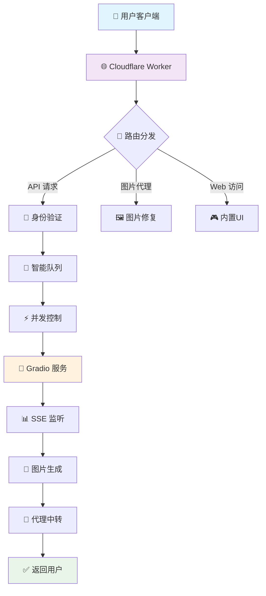

# 🎨 z-image-2api (Cloudflare Worker 终极复刻版) v9.0.0

<div align="center">


[](https://deploy.workers.cloudflare.com/button?url=https://github.com/lza6/z-image-2api-cfwork)

> *"我们不是在写代码，我们是在铸造连接现实与想象的桥梁。每一行指令，都是赋予AI画笔以灵魂的咒语。"*

**✨ 免费 · 开源 · 高性能 · OpenAI 兼容 ✨**

</div>

---

## 🚀 一分钟快速开始

<div align="center">

### ⚡ 一键部署

[](https://deploy.workers.cloudflare.com/button?url=https://github.com/lza6/z-image-2api-cfwork)

### 🎯 快速接入
```bash
API端点: https://your-worker.your-subdomain.workers.dev/v1
API密钥: Bearer your-master-password
支持模型: z-image-turbo-2048, z-image-pro-1024
```

</div>

---

## 📖 目录导航

- [🌟 核心特性](#-核心特性)
- [🏗️ 系统架构](#️-系统架构)
- [🚀 快速部署](#-快速部署)
- [🔧 配置指南](#-配置指南)
- [🎨 使用示例](#-使用示例)
- [🔬 技术详解](#-技术详解)
- [🗺️ 发展路线](#️-发展路线)
- [❓ 常见问题](#-常见问题)
- [📜 开源协议](#-开源协议)

---

## 🌟 核心特性

<div align="center">

| 特性 | 描述 | 状态 |
|------|------|------|
| 🆓 **完全免费** | 基于 Cloudflare Worker 免费套餐，零成本运行 | ✅ 已实现 |
| 🎭 **OpenAI 兼容** | 完美模拟 DALL-E API 接口，无缝接入现有生态 | ✅ 已实现 |
| 🧠 **智能并发控制** | 独创错峰启动机制，保护上游服务 | ✅ 已实现 |
| 🖼️ **图片代理修复** | 彻底解决 Gradio 403 防盗链问题 | ✅ 已实现 |
| 🎮 **内置 Web UI** | 开箱即用的调试界面，实时预览效果 | ✅ 已实现 |
| 🔧 **高度可配置** | 所有参数均可自定义，灵活适应需求 | ✅ 已实现 |

</div>

---

## 🏗️ 系统架构



### 🎯 工作原理

1. **接收请求** - 客户端发送符合 OpenAI 格式的请求
2. **身份验证** - 验证 API Key 确保安全性
3. **智能排队** - 对多图请求进行错峰处理，避免上游过载
4. **Gradio 交互** - 与 Hugging Face 服务进行实时通信
5. **图片代理** - 解决跨域和防盗链问题
6. **标准返回** - 封装为 OpenAI 兼容格式返回

---

## 🚀 快速部署

### 方法一：一键部署（推荐）

<div align="center">

[](https://deploy.workers.cloudflare.com/button?url=https://github.com/lza6/z-image-2api-cfwork)

</div>

**部署步骤：**

1. **点击上方按钮**授权 GitHub 账户
2. **设置项目名称**（如 `my-ai-artist`）
3. **配置环境变量**：
   - 变量名：`API_MASTER_KEY`
   - 变量值：设置一个复杂的密码（如 `sk-your-secret-key-12345`）
   - **重要**：点击 `Encrypt` 加密
4. **点击部署**，等待完成

### 方法二：手动部署

```bash
# 1. 克隆项目
git clone https://github.com/lza6/z-image-2api-cfwork.git
cd z-image-2api-cfwork

# 2. 安装依赖
npm install

# 3. 配置 wrangler
# 编辑 wrangler.toml 文件，设置 name 和 variables

# 4. 部署
npx wrangler deploy
```

---

## 🔧 配置指南

### 环境变量配置

```javascript
// 在 Cloudflare Dashboard 中设置
API_MASTER_KEY = "sk-your-very-secret-password"  // API 访问密钥
```

### 核心参数配置

```javascript
const CONFIG = {
    API_MASTER_KEY: "default_password",      // 默认API密钥
    UPSTREAM_URL: "https://your-gradio-space.hf.space",  // 上游服务地址
    DEFAULT_WIDTH: 1024,                     // 默认图片宽度
    DEFAULT_HEIGHT: 1024,                    // 默认图片高度
    DEFAULT_STEPS: 20,                       // 默认生成步数
    ENABLE_CONCURRENCY_CONTROL: true,        // 启用并发控制
    MAX_CONCURRENT: 1,                       // 最大并发数
    DELAY_RANGE: [1500, 3500]                // 延迟范围(毫秒)
};
```

---

## 🎨 使用示例

### 聊天模式（推荐）

直接在支持 OpenAI 的客户端中使用：

> **用户输入**：`画一只穿着宇航服在月球上喝茶的熊猫，赛博朋克风格，霓虹灯光`

### API 直接调用

```javascript
// 生成图片
const response = await fetch('https://your-worker.workers.dev/v1/images/generations', {
    method: 'POST',
    headers: {
        'Authorization': 'Bearer your-api-key',
        'Content-Type': 'application/json'
    },
    body: JSON.stringify({
        prompt: "A cyberpunk panda drinking tea on the moon, detailed, 4k",
        model: "z-image-turbo-2048",
        n: 2,
        size: "1024x1024"
    })
});

const result = await response.json();
console.log(result.data[0].url); // 生成的图片URL
```

### 支持的客户端

- [LobeChat](https://github.com/lobehub/lobe-chat) ✅
- [NextChat](https://github.com/Yidadaa/ChatGPT-Next-Web) ✅  
- [OpenAI 官方客户端](https://platform.openai.com/docs/api-reference) ✅
- 任何兼容 OpenAI API 的应用 ✅

---

## 🔬 技术详解

### 🏗️ 架构设计模式

| 模式 | 应用 | 优势 |
|------|------|------|
| **适配器模式** | OpenAI API → Gradio API | 无缝兼容现有生态 |
| **代理模式** | 图片防盗链修复 | 解决跨域访问问题 |
| **观察者模式** | SSE 事件监听 | 实时获取生成进度 |
| **策略模式** | 并发控制算法 | 智能负载管理 |

### ⚡ 核心算法

#### 智能并发控制

```javascript
// 错峰启动算法
async function generateWithConcurrency(prompts) {
    const tasks = prompts.map((prompt, index) => 
        index === 0 
            ? generateImage(prompt) // 立即执行第一个
            : sleep(randomDelay()).then(() => generateImage(prompt)) // 延迟执行后续
    );
    
    return await Promise.all(tasks); // 等待所有完成
}
```

#### SSE 事件流处理

```javascript
// 实时监听生成进度
async function listenToGeneration(session_hash) {
    const eventStream = await fetch(`${UPSTREAM_URL}/queue/data`, {
        method: 'POST',
        body: JSON.stringify({ session_hash })
    });
    
    // 处理服务器推送事件
    for await (const event of parseSSE(eventStream)) {
        if (event.event === 'process_completed') {
            return extractImageUrl(event.data);
        }
    }
}
```

### 🔧 故障排除

| 问题 | 症状 | 解决方案 |
|------|------|------|
| **403 错误** | 图片无法显示 | 启用图片代理功能 |
| **生成超时** | 请求长时间无响应 | 检查上游服务状态 |
| **认证失败** | 401 Unauthorized | 验证 API_MASTER_KEY 配置 |
| **并发限制** | 部分图片生成失败 | 调整并发控制参数 |

---

## 🗺️ 发展路线

<div align="center">

### 🎯 版本规划

| 版本 | 状态 | 主要特性 |
|------|------|------|
| v9.0 Reborn | ✅ 已完成 | 核心功能稳定版 |
| v9.1 Enhance | 🚧 开发中 | 多上游负载均衡 |
| v9.2 Advanced | 📅 规划中 | 动态模型发现 |
| v10.0 Enterprise | 💡 构想中 | 分布式任务队列 |

</div>

### 🔮 未来特性

1. **🌐 多上游负载均衡**
   - 自动故障转移
   - 智能服务选择
   - 健康状态监测

2. **📊 高级队列系统**
   - KV 存储持久化
   - 任务状态查询
   - 优先级调度

3. **🔍 动态模型发现**
   - 自动模型列表更新
   - 参数模板管理
   - 实时能力检测

4. **🎛️ 增强参数支持**
   - 负向提示词
   - 采样器选择
   - 种子控制

---

## ❓ 常见问题

### 🤔 基础问题

**Q: 这个服务真的完全免费吗？**  
A: ✅ 是的！基于 Cloudflare Worker 的免费套餐，个人使用完全免费。

**Q: 需要服务器吗？**  
A: ❌ 不需要！所有代码运行在 Cloudflare 的边缘网络上。

**Q: 支持哪些图片尺寸？**  
A: 默认支持 512x512, 768x768, 1024x1024, 2048x2048，可在配置中自定义。

### 🔧 技术问题

**Q: 为什么需要图片代理？**  
A: Gradio 服务有防盗链机制，直接返回的图片链接会返回 403 错误。

**Q: 并发控制是什么意思？**  
A: 当一次请求多张图片时，我们会错开请求时间，避免瞬间打爆上游服务。

**Q: 如何提高生成速度？**  
A: 生成速度主要取决于上游服务，建议使用较简单的提示词和较小的尺寸。

### 🎨 使用问题

**Q: 支持中文提示词吗？**  
A: ✅ 完全支持！中英文提示词都可以正常使用。

**Q: 可以商用吗？**  
A: 📜 请查看 Apache 2.0 协议详情，通常可以商用但需要保留版权声明。

**Q: 如何获取技术支持？**  
A: 请在 GitHub 仓库提交 Issue 或 Discussion。

---

## 📜 开源协议

本项目采用 **Apache License 2.0** 开源协议。

### 你可以：
✅ 免费使用于个人或商业项目  
✅ 修改和分发代码  
✅ 专利授权使用  

### 你需要：
📝 保留原始版权和许可声明  
📝 声明修改内容  
📝 包含 NOTICE 文件（如果有）

### 我们：
⚠️ 不提供任何担保  
⚠️ 不承担使用后果  

---

<div align="center">

## 🎉 开始创造吧！

**你的想象力是唯一的限制**

[](https://deploy.workers.cloudflare.com/button?url=https://github.com/lza6/z-image-2api-cfwork)
[](https://github.com/lza6/z-image-2api-cfwork)

*"每一行代码都是通往新世界的门户，每一次生成都是想象力的绽放"*

</div>

---

<div align="center">

**Made with ❤️ by the Open Source Community**

[](https://github.com/lza6/z-image-2api-cfwork/stargazers)
[](https://github.com/lza6/z-image-2api-cfwork/network/members)
[](https://github.com/lza6/z-image-2api-cfwork/issues)

</div>
